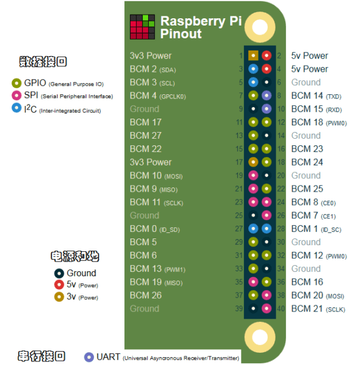
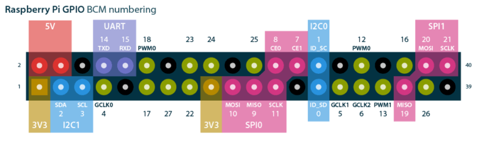

##### 本章 [参考链接](https://www.basemu.com/raspberry-pi-4-gpio-pinout.html) #####

### 树莓派4的GPIO接口 ###

### 通用输入/输出接口 GPIO ###

通用输入/输出就是GPIO的意思，GPIO很形象地描述了树莓派上这些接口的工作方式，它们类似于Arduino 数字或模拟端口，因为我们可以将它们配置为读或写。通过这些接口，可以让树莓派和不同的模块组件进行交互，比如按钮、电位器或者蜂鸣器等。

在实际使用中，我们应该熟悉树莓派接口的两种命名方案:1.WiringPi 编号、BCM编号、物理编号（Physical – Number）。WiringPi 编号是功能接线的引脚号（如TXD、PWM0等等）；BCM编号是 Broadcom 针脚号，也即是通常称的GPIO；物理编号是PCB板上针脚的物理位置对应的编号（1~40）。

### 电源和接地 ###

电源和接地引脚用于外部电路供电。所有版本标准40针 GPIO版本的树莓派都有两个5V引脚和两个3.3V引脚，而且均在同一个物理位置。除了5V和3.3V引脚外，它们还有8个接地引脚。电源和接地脚可以让你的树莓派为一些外部元件供电，如LED。需要注意的是，通过这些引脚为任何外部模块或元器件供电之前，应该保持谨慎，过大的工作电流或峰值电压均有可能损坏树莓派。

### 其它接口功能 ###

在实际使用中，许多项目还需要一些不同的功能。因此树莓派的一些GPIO引脚具有I2C、SPI和UART接口等双重功能，与树莓派3B+相比，树莓派4 支持这些功能的接口增加了，使许多引脚的功能得到了扩展。下面是对每种功能做一下简要的描述。

#### I2C接口 ####

I2C是由Philips公司开发的一种简单、双向二线制同步串行总线。它只需要两根线即可在连接于总线上的器件之间传送信息。树莓派通过I2C接口可控制多个传感器和组件。它们的通信是通过SDA(数据引脚)和SCL(时钟速度引脚)来完成的。每个从设备都有一个唯一的地址，允许与许多设备间快速通信。ID_EEPROM引脚也是I2C协议，它用于与HATs通信。

#### SPI接口 ####

SPI是串行外设接口，用于控制具有主从关系的组件，采用从进主出和主进从出的方式工作，树莓派上SPI由SCLK、MOSI、MISO接口组成，SCLK用于控制数据速度，MOSI将数据从树莓派发送到所连接的设备，而MISO则相反。

#### UART接口 ####

有使用Arduino的朋友一定听说过UART或Serial，通用异步收/发器接口用于将Arduino连接到为其编程的计算机上，也用于其他设备与 RX 和 TX 引脚之间的通信。如果树莓派在 raspi-config 中启用了串口终端，则可以使用这些引脚通过电脑来控制树莓派，也可以直接用于控制Arduino。

#### PWM接口 ####

在树莓派上，所有的引脚都可以实现软件PWM，而GPIO12、GPIO13、GPIO18、GPIO19可以实现硬件脉宽调制。关于PWM可阅读 [什么是PWM](https://www.basemu.com/what-is-pwm.html) 这篇文章。

本文章来源于网络，侵删
