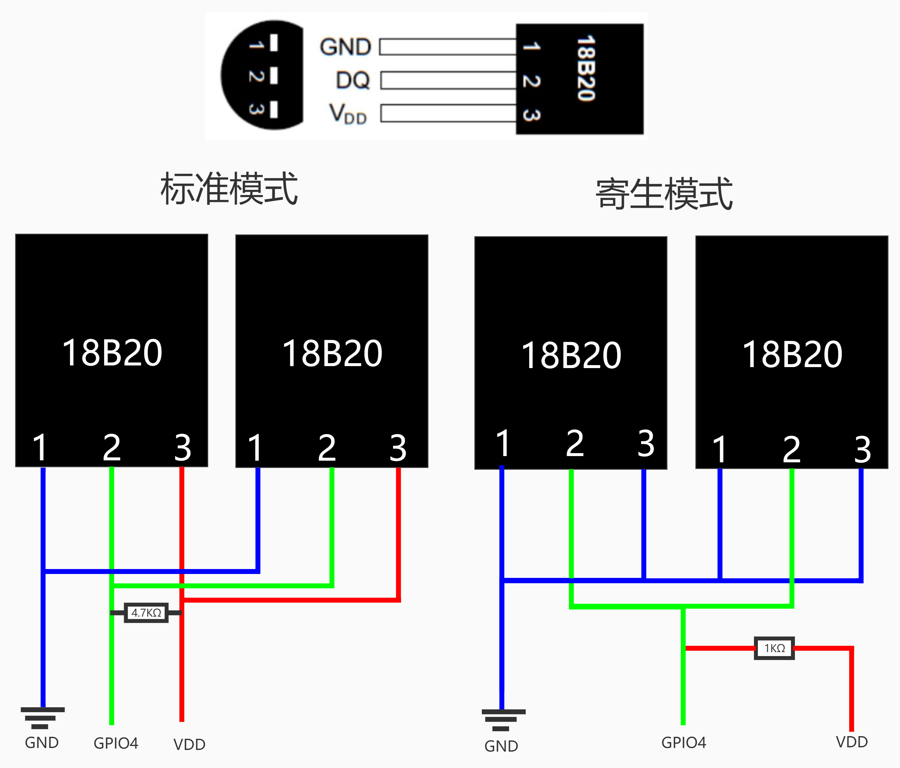

# 基于DS18B20的温度测量 #

元件：ds18b20，杜邦线，1kΩ或者4.7kΩ电阻一个

### 技术规格 ###

- 电压 : 3.3V to 5V
- 温度范围 :-55 °C ~  +125 °C
- 接口: 数字（单总线）
- 尺寸:22x32mm
- 重量：12g

### 软件设置 ###

打开/boot/usercfg.txt文件，添加以下代码----[参考链接](http://bbs.nxez.com/thread-67-1-1.html)

```
dtoverlay=w1-gpio-pullup,gpiopin=4
```

### 设备连接 ###



重启后运行

```
sudo modprobe w1-gpio
sudo modprobe w1-therm
cd /sys/bus/w1/devices
ls
cd 28-xxxx (xxxx是一个十二位的设备ID)
cat w1_slave
```

读出来的温度需要除以1000得到实际温度

[另外一篇参考资料](https://shumeipai.nxez.com/2014/09/13/raspberry-pi-ds18b20-temperature-sensor.html)