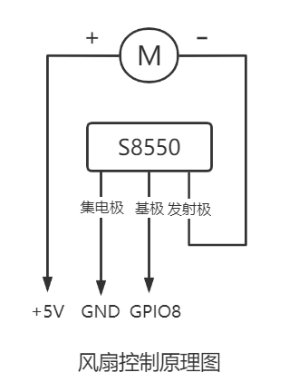

## 风扇控制 ##

元件：三极管S8550，5V风扇，杜邦线



程序：
#### 方法一：bash

```bash
#!/bin/bash

if [ -e /sys/class/gpio/gpio14/direction ]
then
echo "已经挂载"
else
echo "未挂载"
echo 14 > /sys/class/gpio/export
echo out > /sys/class/gpio/gpio14/direction
echo 1 > /sys/class/gpio/gpio14/value
fi

tem=$(cat /sys/class/thermal/thermal_zone0/temp)
echo $tem

if [ $tem -ge 65000 ]
then
echo out > /sys/class/gpio/gpio14/direction
fi

if [ $tem -le 40000 ]
then
echo 1 > /sys/class/gpio/gpio14/value 
echo 14 >/sys/class/gpio/unexport
echo "温度不高，已经unexport"
fi
```

cron：（每隔1分钟执行一次）

crontab -e

```bash
*/1 * * * * sudo bash /home/pi/python/fan.sh
```

#### 方法二：Python控制

```python
#!/usr/bin python3
# -*- coding:utf-8 -*-
# Author:李绍丰 河北工业大学-能源与环境工程学院

# ****************************************************************
# 程序功能：风扇控制
# 模块划分：开启风扇，关闭风扇，获取CPU温度
# ****************************************************************

import RPi.GPIO as GPIO
import time

fan_pin = 14
GPIO.setwarnings(False)
GPIO.setmode(GPIO.BCM)
GPIO.setup(fan_pin,GPIO.OUT)

def on_fan():
    GPIO.output(fan_pin,False)

def off_fan():
    GPIO.output(fan_pin,True)

def get_CPU_temp():
    with open(r"/sys/class/thermal/thermal_zone0/temp") as file:
        temp = float(file.read()) / 1000
    return temp

# on_fan()
off_fan()
while True:
    temp = get_CPU_temp()
    if temp > 55:
        on_fan()
    if temp < 38:
        off_fan()
    time.sleep(30)
```


成品图：


